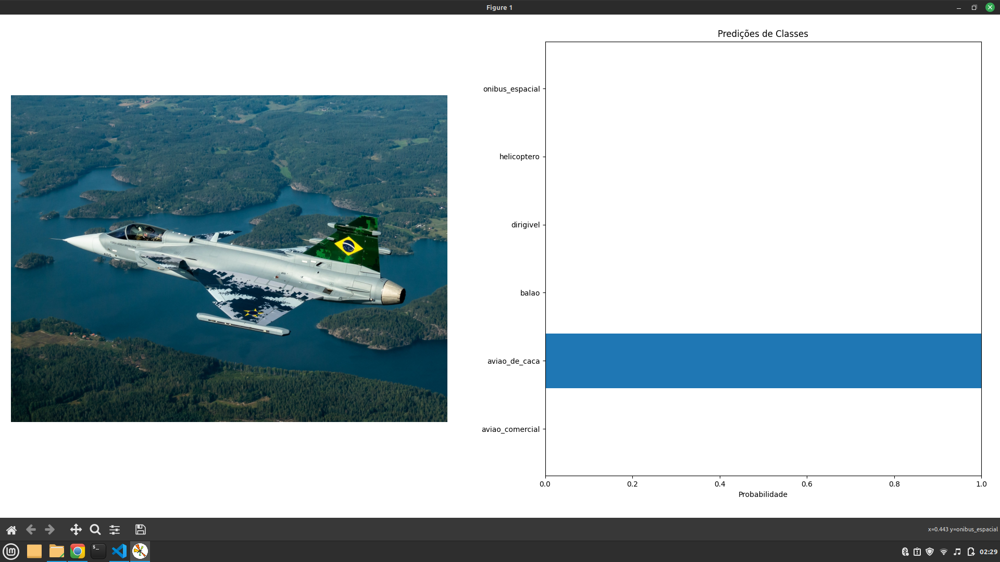

Programa de Ação do Funcionário | Ano 2024

FUNCIONÁRIO: Mateus Nascimento Brito

AVALIADOR: Oberdan Rocha Pinheiro

AÇÃO/INICIATIVA: Desenvolver uma prova de conceito de classificador de multiplas classes relacionada a temática "aeroespacial"

---------- SOBRE A APLICAÇÃO ----------

O QUE É:

Uma aplicação que se utiliza de aprendizado de máquina para prever em qual classe relacionada à temática aeroespacial uma dada imagem está associada.

CLASSES:

* Avião Comercial
* Avião de Caça
* Balão
* Dirigivel
* Helicóptero
* Ônibus Espacial

COMO UTILIZAR:

PASSO 1: Adicionar na pasta "imagens-de-teste" imagens relacionadas às classes

PASSO 2: Executar o arquivo main.py

DATASET:

O dataset usado para treinar o modelo está disponível em: https://drive.google.com/file/d/1Oc-poAVSiXKUp7ugBF5mhJW9KvmI7Yae/view?usp=sharing

DEPENDÊNCIAS:

pytorch

torchvision

timm